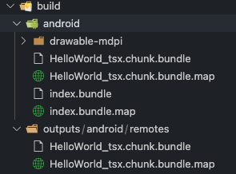

### Ý tưởng

#### RAM Bundles and Inline Requires
RAM là một kỹ thuật mới được ra mắt từ bản React Native 0.7

Nếu bạn có một ứng dụng lớn, với nhiều màn hình, tính năng mà có thể sẽ không bao giờ được dùng tới bởi người dùng. Bạn có thể dùng `RAM Bundles and Inline Requires`. 

Nói chung, nó hữu ích cho các ứng dụng lớn, nhiều file code, nhiều màn hình mà không thật sự cần thiết sau khi khởi động app.

Ví dụ ứng dụng có các tính năng ít được sử dụng hơn, hầu hết người dùng mở app chỉ để sử dụng các chức năng chính. `RAM Bundles and Inline Requires` sẽ giúp bạn tối ưu hóa việc tải ứng dụng khi mở app, các phần code của các chức năng chưa cần dùng đến sẽ được tải khi người dùng thực sự mở tính năng đó.

### Code Splitting

`Code Splitting `là một kỹ thuật tách code thành nhiều file, có thể nạp vào chương trình khi cần dùng.

#### Ứng dụng
- Tối ưu hóa kích thước ban đầu của ứng dụng, từ đó cải thiện hiệu suất app, thời gian khởi động app bằng cách bỏ qua các mã chưa cần thiết khi app startup

- Cá nhân hóa giao diện, tính năng cung cấp cho các người dùng khác nhau mà không ảnh hưởng đến dung lượng và `performance` của app gốc.

- Đối với developer và team developer: `Code Splitting` giúp chia nhỏ và cô lập các module, tập tính năng với nhau giúp cải thiện khả năng mở rộng và phụ thuộc.

`Code Splitting` dựa theo cơ sở hạ tầng của `Webpack`, `native module` cho phép thực thi các code bổ sung trên cùng một `Javascript context` (trên cùng một phiên bản React-Native)


### Khởi tạo project

#### Khởi tạo và cấu hình App
- Khởi tạo react-native project
```
npx react-native init MyApp
yarn add --dev @tsconfig/react-native @types/jest @types/react @types/react-test-renderer typescript @types/react-test-renderer typescript
```

- Cài đặt `repack`
```
yarn add -D webpack terser-webpack-plugin babel-loader @callstack/repack
```

- Cấu hình `React Native`
  
Thêm dòng code bên dưới vào file `react-native.config.js`

```
module.exports = {
  commands: require('@callstack/repack/commands')
};
```

- Cấu hình `Webpack`

Tạo file `webpack.config.mjs` tại thư mục gốc và thêm nội dung mẫu từ [Webpack config template](https://github.com/callstack/repack/blob/main/templates/webpack.config.mjs)

- Cấu hình `Android`

Mở file `android/app/build.gradle` Thêm  `bundleCommand: "webpack-bundle" vào `project.ext.react`

```
project.ext.react = [
    enableHermes: false,  // clean and rebuild if changing
    bundleCommand: "webpack-bundle",
]
```

#### Thêm script thường dùng

Thêm các script hay dùng vào `package.json`

```
"android": "react-native run-android --no-packager",
"start": "npx react-native webpack-start"
```

### Các thuật ngữ chính

Vì hơi dài nên mọi người có thể tham khảo tại [đây](https://re-pack.netlify.app/docs/code-splitting/glossary)
### Ứng dụng Demo
#### Viết code

- Mở `index.js` thêm đoạn code sau

```
ScriptManager.shared.addResolver(async (scriptId) => {
  console.log('addResolveraddResolveraddResolver', scriptId);

  //In dev mode, resolve script location to dev server.
  if (__DEV__) {
    return {
       url: Script.getDevServerURL(scriptId),
       cache: false,
     };
  }
  
  return {
    url: Script.getRemoteURL(`https://container-host.onrender.com/chunk/${scriptId}`)
  };
});

```
Đoạn code này giúp tùy biến và xử lý việc `chunk` sẽ được lấy ở đâu trước khi load.
Nếu bạn muốn `cache` lại các `chunk` đã load, có thể thêm đoạn code này vào trước  `addResolver`

```
ScriptManager.shared.setStorage(AsyncStorage);
```

- Tạo mới một component `HelloWorld.tsx`

```
import React from 'react';
import { Text } from 'react-native/types';

export default function HelloWorld() {
    return <Text>Hello World from any where </Text>;
}
```

Component này chỉ đơn giản in ra dòng chữ `Hello World from any where`

- Mở file `App.tsx` sửa code thành như sau

```
import * as React from 'react';
import { Text } from 'react-native';

const HelloWorld = React.lazy(() => import('./HelloWorld'));
export default function App() {
  return <React.Suspense fallback={<Text>Loading...</Text>}>
    <HelloWorld />
  </React.Suspense>
}
```

Ở đây, component `HelloWorld` thay vì được import như thông thường thì sẽ được lazy import bằng cách dùng `React.lazy`. Component `HelloWorld` được bọc trong `React.Suspense`, nó sẽ render ra Component trong `fallback` cho đến khi load và render xong `HelloWorld`

Các script được import từ `React.lazy` sẽ tự động được tạo thành các chunk, tách riêng ra khỏi bundle chính của app

#### Chạy code

- Bundling 

Cài `webpack-cli`

```
yarn add webpack-cli --dev
```

Bundling app

```
npx webpack-cli -c webpack.config.mjs --env platform=android --env mode=development
```

Sau khi chạy xong các bạn sẽ thấy 1 chunk tên `HelloWorld_tsx.chunk.bundle` được tạo ra trong thư mục build như sau



Như các bạn có thể thấy, toàn bộ script của `HelloWorld` đã được tạo thành một bundle riêng và tách ra khỏi `index.bundle`. `HelloWorld_tsx.chunk.bundle` sẽ được load vào chương trình khi cần bằng `React.lazy`, nó có thể dược lưu ở local hoặc host trên server/cdn

- Run app

Chạy debug app giống như một project React-Native thông thường

```
yarn run android

yarn run start
```

#### Host chunk lên remote server

- Để phục vụ cho các yêu cầu đặc biệt, chúng ta hoàn toàn có thể host các chunk đã được tạo ra trên 1 server nào đó mà ứng dụng có thể kết nối để download được về.

- Bước 1: Host 2 file `HelloWorld_tsx.chunk.bundle` và `HelloWorld_tsx.chunk.bundle.map` trên một server/vps/cloud có url ví dụ : `https://my-chunk-manager.com`

Đảm bảo từ ứng dụng có thể get được 2 file trên qua đường dẫn:

[https://my-chunk-manager.com/HelloWorld_tsx.chunk.bundle](https://my-chunk-manager.com/HelloWorld_tsx.chunk.bundle)

[https://my-chunk-manager.com/HelloWorld_tsx.chunk.bundle.map](https://my-chunk-manager.com/HelloWorld_tsx.chunk.bundle.map)

- Bước 2: Thay url `https://my-chunk-manager.com` vào `getRemoteURL` trong function `ScriptManager.shared.addResolver`

Như vậy, tất cả phần code được bundle và tách ra đã được lưu và quản lý trên 1 server riêng biệt.

## Code Push

CodePush chỉ được hỗ trợ nếu bạn không sử dụng Code Splitting.

Với `Code Splitting`, Việc sử dụng `Code Push` vẫn có thể làm được nhưng bạn có thể gặp phải 1 vài khó khăn. Nhìn chung, nên giới hạn việc sử dụng `Code Push` cho `Main Bundle`. Các `chunk.bundle` được update dựa vào Caching & Versioning để vô hiệu hóa và tải xuống các script mới.

Chúng ta có thể thực hiện `Code Push` với `Code Splitting` theo các bước sau:

1. Bundling ứng dụng bằng Webpack và Re.Pack.
2. Upload `chunk` lên server/CDN.
3. Deploy App chính lên chợ ứng dụng.
4. Thay đổi code.
5. **Thay đổi method/url/query/header hoặc body** khi resolver trong `ScriptManager.shared.addResolver`.
6. Upload `chunk` lên server/CDN theo **method/url/query/header hoặc body mới** từ bước số 5.
7. Update Main Bundle bằng CodePush.
9. Khi bản Main Bundle mới được load, nó sẽ trả về **method/url/query/header hoặc body** khác nhau, từ đó sẽ vô hiệu hóa cache và script mới sẽ được tải xuống.


## Lời kết
Vừa rồi mình đã giới thiệu sơ qua đến các bạn về Code Splitting, ứng dụng và demo trên React-Native. Đây chỉ là những gì mình thu nạp được sau khi nghiên cứu trên mạng nên có nhiều thiếu sót. Hy vọng mọi người sẽ cùng nhau xây dựng.

Bài tới mình sẽ giới thiệu đến các bạn `Module Federation`, và ứng dụng nó để xây dựng `Micro-Fronent`, Mini app

## Tài liệu tham khảo

- [https://re-pack.netlify.app/docs/code-splitting](https://re-pack.netlify.app/docs/code-splitting)