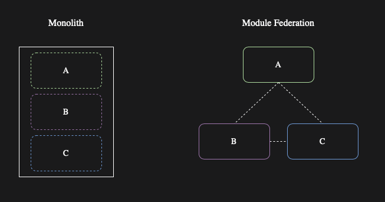
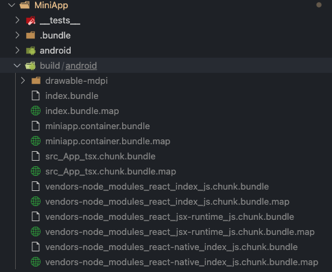

## Lời mở đầu

Trước khi bắt đầu, hãy chắc chắn bạn đã đọc bài về [Code Splitting](https://yinbetterdev.github.io/2023/react-native-code-spliting-with-webpack/).

### Module Federation

`Module Federation` tương tự như `Code Splitting` nhưng có khả năng tùy biến và mở rộng.

`Module Federation` là một kiến trúc, nó giúp phân chia ứng dụng thành nhiều phần. Những phần này được gọi là các container. Tương tự như micro-services, Module Federation phân chia ứng dụng thành nhiều frontend phân tán, đôi khi được gọi là micro-frontends.



### Ưu điểm
- Khả năng chia ứng dụng thành nhiều micro-frontends cô lập.
- Khả năng tùy chỉnh cấu hình và quá trình phát triển từng micro-frontend.
- Khả năng tùy biến tải một micro-frontends theo yêu cầu.
- Khả năng load các phiên bản khác nhau của micro-fontends theo từng mục đích.

### Thách thức

Không phải dự án nào cũng phù hợp để triển khai `Module Federation`, việc triển khai `Module Federation` có thể gặp những trở ngại như:

- Dễ gây ra `dependency duplication`, ví dụ: khi bạn sử dụng các phiên bản không tương thích trong `micro-frontends/container`.

- Cần sự nhất quán cấu hình Webpack giữa các `micro-fronent/container` nếu không có thể dẫn đến việc không tương thích

- Làm phức tạp việc triển khai - mỗi `micro-frontend/container` phải được triển khai và sẵn sàng cho người dùng (thường qua Internet).

- Làm phức tạp việc quản lý phát hành - bạn cần đảm bảo các `micro-frontend/container` được cô lập một cách tối đa và không phụ thuộc vào nhau, nếu không bạn cần đảm bảo rằng các `micro-frontend/container` phụ thuộc phải được phát hành cùng nhau.


### Khởi tạo project

#### Khởi tạo và cấu hình HostApp và MiniApp

- Khởi tạo 2 project `HostApp` và `MiniApp`. Cấu hình giống như project được khởi tạo ở phần `Code Splitting`

- Thêm cấu hình `ModuleFederation` vào `webpack.config.mjs` của `HostApp`

```
new Repack.plugins.ModuleFederationPlugin({
        name: 'hostapp',
        shared: {
          react: {
            ...Repack.Federated.SHARED_REACT,
            requiredVersion: '17.0.2',
          },
          'react-native': {
            ...Repack.Federated.SHARED_REACT_NATIVE,
            requiredVersion: '0.68.2',
          },
        },
      }),
```


- Làm tương tự với `MiniApp`

```
new Repack.plugins.ModuleFederationPlugin({
        name: 'miniapp',
        exposes: {
          './App': './src/App.tsx',
        },
        shared: {
          react: {
            ...Repack.Federated.SHARED_REACT,
            eager: STANDALONE, // to be figured out
          },
          'react-native': {
            ...Repack.Federated.SHARED_REACT_NATIVE,
            eager: STANDALONE, // to be figured out
            requiredVersion: '0.71.4',
          },
        },
        remotes: {
          hostapp: 'hostapp@dynamic',
        },
      }),
```

- `Repack.plugins.ModuleFederationPlugin` giúp `MiniApp` và `HostApp` giao tiếp được với nhau. Ở đây chúng ta thấy `MiniApp` sẽ `exposes` và `share` file `App.tsx`. Từ đó `HostApp` có thể load script đó và dùng như một component thông thường

### Viết Code ở HostApp

- Mở file `index.js` thêm đoạn code sau:

```
const resolveURL = Federated.createURLResolver({
  containers: {
    miniapp: 'http://localhost:9001/[name][ext]',   
  },
});

ScriptManager.shared.addResolver(async (scriptId, caller) => {
  
  let url;
  if (caller === 'main') {
    url = Script.getDevServerURL(scriptId);
  } else {
    url = resolveURL(scriptId, caller);
  }

  if (!url) {
    return undefined;
  }
  let result = 
   {
    url,
    cache: false, // For development
    query: {
      platform: Platform.OS,
    },
  };

  return result
});


AppRegistry.registerComponent(appName, () => App);

```

Cũng giống như `Code Splitting`, chúng ta sẽ khai báo một `resolver` để điều hướng việc load các container khi được gọi.

Với `Module Federation` chúng ta sẽ tạo thêm một resolveURL riêng như code ở trên.

Theo đó ta có thể thấy `container` `miniapp` sẽ được load từ `http://localhost:9001`. Đây là đường dẫn local khi chạy debug. Các bạn có thể host container trên bất kỳ server/CDN nào và thay URL giống như `Code Splitting`

- Mở file `App.tsx` thêm đoạn code như sau:

```

import { Federated, ScriptManager } from '@callstack/repack/client';
import React, { Component } from 'react';
import { Text} from 'react-native';

const MiniApp = React.lazy(() => Federated.importModule('miniapp', './App'));

class App extends Component<{}> {
  
  render(): React.ReactNode {
    return (
      <React.Suspense fallback={<Text>Loading Mini App ...</Text>}>
        <MiniApp/>
      </React.Suspense>

    );
  }
}

export default App


```

Ở đây component `MiniApp` cũng được load qua `React.lazy` tuy nhiên nó sẽ đi qua import của `Federation`. Chúng ta sẽ phải truyền vào container `miniapp`

Sau khi load xong, component `MiniApp` sẽ được sử dụng như một component thông thường.

### Viết Code ở MiniApp

- Mở file `App.tsx` thêm đoạn code như sau:

```
import * as React from 'react';
import { Text } from 'react-native';

export default function App() {
  return <Text> This is a Mini App from any where </Text>
}

```

Code này chỉ đơn giản in ra dòng chữ `This is a Mini App from any where`


### Test Debug

#### Bundle MiniApp, HostApp

- Dùng webpack để tạo container miniapp.

```
npx webpack-cli -c webpack.config.mjs --env platform=android --env mode=development
```

- Làm tương tự với `HostApp`

Sau khi chạy xong, chúng ta sẽ có các file container được tạo ra trong thư mục `build` như ảnh



### Khởi chạy

- Start metro bundle ở `MiniApp` với port 9001

```
yarn run start

[DevServer] Server listening at http://127.0.0.1:9001 

```

- Chạy app ở `HostApp` trên máy android với port 8081 như project bình thường


```
yarn run android
```

Sau khi `HostApp` khởi động xong, chúngg ta sẽ thấy trong console, `HostApp` sẽ gửi request tới `localhost:9001` để load các container từ `MiniApp`. Lúc này bên phía console của `MiniApp` chúng ta sẽ thấy các bundle được load. Sau khi load xong, nội dung từ `MiniApp` sẽ được hiển thị đầy đủ ở `HostApp`.


Như vậy chúng ta đã demo thành công 1 Host app và 1 Mini App. Chúng ta có thể tạo ra nhiều Mini App khác. Các Mini App hoàn toàn có thể gọi đến nhau và share script, component cho nhau như kiến trúc Module Federation ở trên. 


### Host MiniApp lên server

Cũng giống như `Code Splitting`, chúng ta hoàn toàn có thể host các container có được khi bundling `MiniApp` ở bước trên, sau đó thay url tương ứng vào phần `resolveURl` ở host app.

Việc đẩy `Code Push` cũng thực hiện tương tự như `Code Splitting`


## Lời Kết

Như vậy chúng ta đã đi qua 2 kỹ thuật `Code Splitting` và `Module Federation`. Trên đây chỉ là các demo nho nhỏ cho các kiến trúc này, để có thể áp dụng được vào project lớn hiện tại sẽ còn rất nhiều vấn đề khác. Rất mong có được sự góp ý từ mọi người !